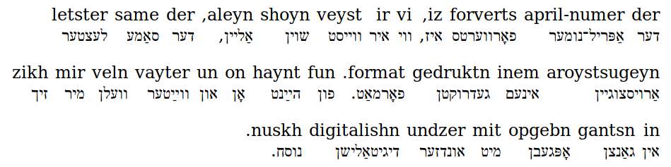

A helper for beginners like me who are trying to learn to read Yiddish. This script accepts a url for a story in *[Forverts](http://yiddish.forward.com)* and outputs a plain html page with an added interlinear transliteration of the Yiddish text into the Roman alphabet. 

The transliteration process is a naive series of search-and-replace operations.

Install:

```
bundle install
```

(The only dependency is nokogiri.)

Run:

```
./parse.rb "http://yiddish.forward.com/articles/214617/saying-good-by-to-our-treasured-printed-edition/?" > saying-good-by-to-our-treasured-printed-edition.html
```

Output:



Tests:

```
rspec spec/yiddishtransliteration.rb
```
